# dataset-generation-using-gans

The type of dataset is identified using a function that employs structural similarity index as a measure to check similarity between images. Out of all the methods of error and similarity detection, it was experimentally found that SSIM was the beast measure to find the structural similarity between images. The DCGAN approach allows for the creation of clear, realistic-looking pictures while avoiding mode collapse and training instability caused by imbalanced Discriminator and Generator. The functions utilized inside the equation must be 1-Lipschitz in order to solve it and get the minimum loss. This is accomplished by using the gradient penalty, which penalizes any function that deviates from the 4 intended norm value of 1.

TensorFlow implementation of [Learning from Simulated and Unsupervised Images through Adversarial Training](https://arxiv.org/abs/1612.07828).

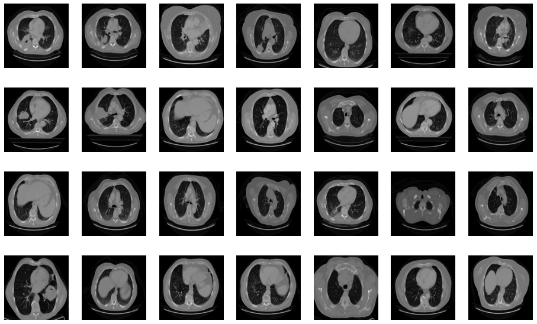

## Requirements

- Python 3.7+
- [TensorFlow](https://www.tensorflow.org/) 2.0+
- [SciPy](http://www.scipy.org/install.html)
- [pillow](https://github.com/python-pillow/Pillow)
- [tqdm](https://github.com/tqdm/tqdm)

The GAN used in this paper is based on images with a resolution of 128, 128, 3. Both Generator and Discriminator are convolutional neural networks with the properties listed in. Generator receives a random noisevector as input. It is then upsampled by transposed convolutional layers with a stride of 2 utilizing 512, 256, 126, 64, and 32 distinct filters Discriminator receives a 4 L. Middel et al. 128,182, 3 picture, which can be real or created, and downsamples it using four convolutional layers with 64, 128, 256, and 512 filters each. Because there are presently no standard settings that perform well for all datasets, hyperparameters (learning rate, batch size, and kernel size) were determined through trial and error. With a learning rate of 3e-4, a batch size of 128, and a kernel size of 5, values of hyperparameters with overall satisfactory visual outcomes were attained. The models were trained for 150 epochs with all pictures accordingly. The names of the datasets are listed above. Although the number of epochs might be increased, the discriminator and generator losses were stabilized at the quantity set.

The evolution of the network was recorded after every 15 epochs and the training took place for a total of 150 epochs. The evolution was as follows-

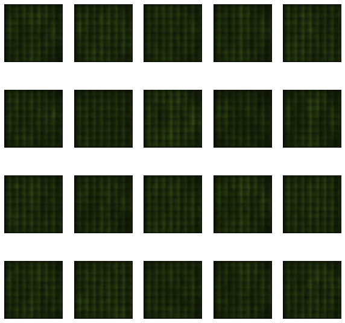

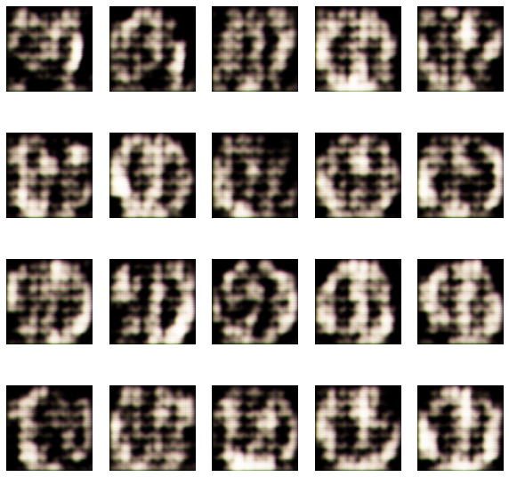
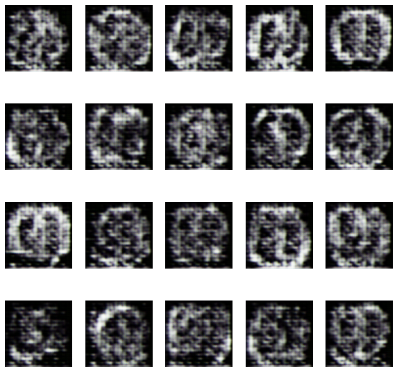
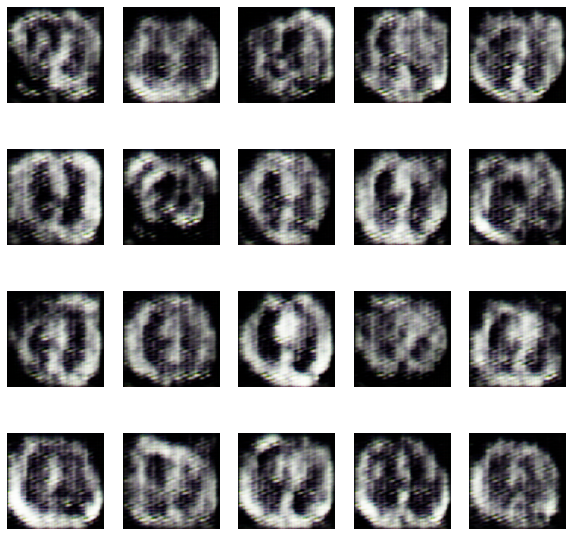
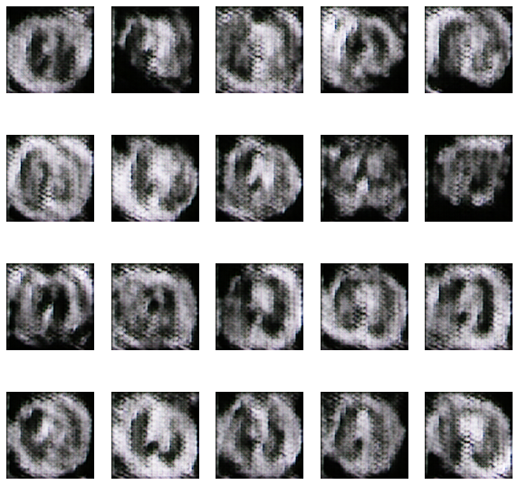
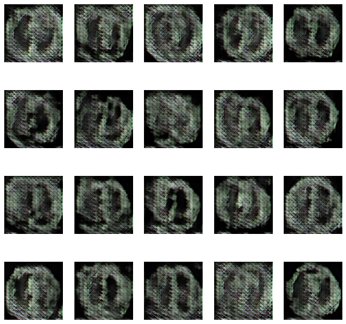
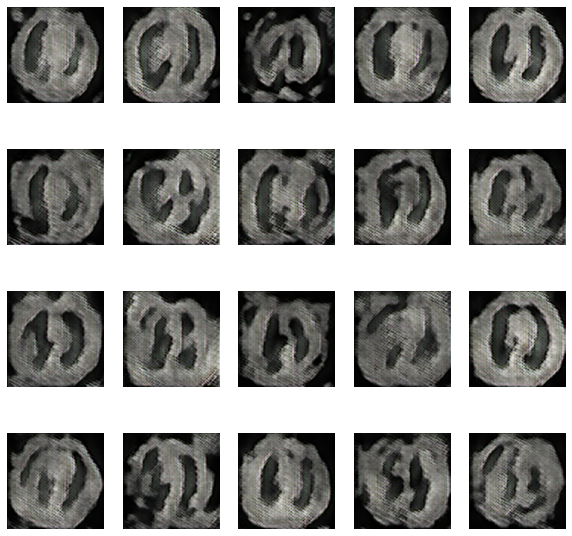
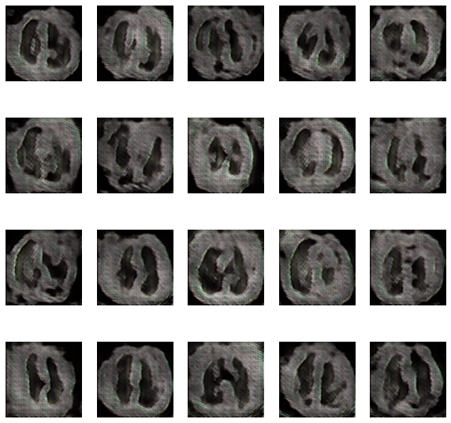
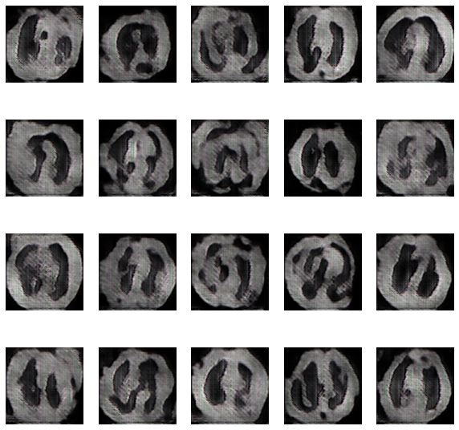

Training loss of discriminator and generator-

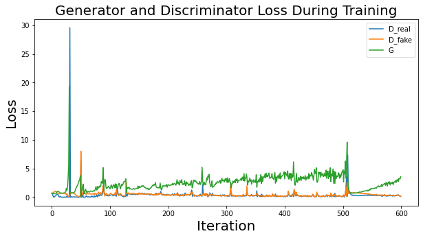
